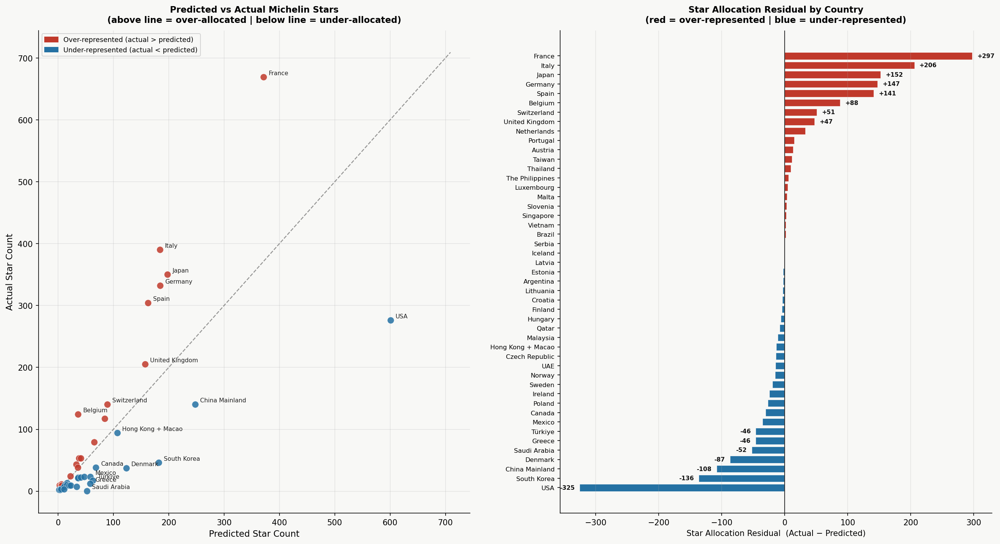

```{r setup, include=FALSE}
knitr::opts_chunk$set(echo = TRUE, warning = FALSE, message = FALSE)
```

---
class: title-slide

.title-left[

# Starred and Questioned

### Data Science Capstone Project

<br>

**David Whitmer & Benjamin Fox**

*2026*

<br><br>

.small[Are Michelin Stars efficiently allocated across global markets<br>given economic, geographic, and market constraints?]

]

.title-right[
```{r echo=FALSE, out.width="82%", fig.align="right"}

```
]

---
class: section-slide, center, middle

# Research Question

---
class: content-slide

# Research Question

<br>

.research-box[

### Are Michelin Stars efficiently allocated across global markets in 2026 given economic, geographic, and market constraints?

]

<br>

.pull-left[
**What we're testing:**
- Do GDP, tourism, and restaurant market size predict star allocation?
- Which countries receive more stars than their economic profile predicts?
- Which countries receive fewer?
]

.pull-right[
**Why it matters:**
- Michelin has expanded from a French motoring guide to a global authority
- $120+ years of institutional history may distort supposedly objective criteria
- Quantifying that distortion requires a rigorous model
]

---
class: section-slide, center, middle

# Data Collection

---
class: content-slide

# Data Collection

.two-col[
.col-left[
### 3.1 Michelin Guide Scraping

The 2026 Michelin Guide was collected in **March 2026** via the Algolia search API embedded in `guide.michelin.com`.

- Public frontend API key extracted from browser DevTools
- App ID: `8NVHRD7ONV`
- **18,837 restaurants** retrieved globally
- 53 countries and territories

Each record includes:
- Award level
- Cuisine type & pricing tier
- City, country, coordinates
- Guide URL
]

.col-right[
### 3.2 External Variable Compilation

Four country-level variables compiled for **47 model countries**:

.var-badge[GDP per Capita]
World Bank WDI `NY.GDP.PCAP.CD` · IMF WEO for Taiwan · Hardcoded from WB country pages for Türkiye & China Mainland

.var-badge[Urbanization Rate]
World Bank WDI `SP.URB.TOTL.IN.ZS` · CIA World Factbook for Taiwan (80.1%, 2023)

.var-badge[Tourism Arrivals]
UNWTO World Tourism Barometer + STB, JNTO, KTO, HKTB · **2023 as primary regression year**

.var-badge[Restaurant Counts]
Eurostat NACE 56.1 for EU · national equivalents elsewhere · Confidence flags: HIGH / MEDIUM / LOW
]
]

---
class: content-slide

# Clean Dataset

<br>

.code-output[
```
Shape: (47, 44)
Countries: 47

Missing values in key columns:
country                             0
n_total_starred                     0
gdp_per_capita_usd_2023             0
restaurant_count                    0
tourism_2023                        0
urban_pct_2023                      0
median_price_floor_usd_starred      1  ← Saudi Arabia (0 stars; filled with overall median)
```
]

<br>

.footnote-text[
One missing value in `median_price_floor_usd_starred` — Saudi Arabia has zero starred restaurants, so no starred price floor exists. Filled with the country's overall median price floor as a proxy. Saudi Arabia is later flagged as a **structural zero** and excluded in the robustness check.
]

---
class: section-slide, center, middle

# Data Cleaning & Preparation

---
class: content-slide

# Data Cleaning & Preparation

.three-col[
.col-third[
### 4.1 Territory Consolidation

Several Michelin territories do not map to sovereign states:

- 🇫🇷 **Andorra + Monaco → France**  
  Tourism & restaurant counts summed; GDP & urban from France

- 🇨🇭 **Liechtenstein → Switzerland**  
  Same logic

- 🇭🇰 **Hong Kong + Macao → Combined row**  
  Counts summed; GDP & urban from HK SAR

- 🇦🇪 **Abu Dhabi + Dubai → UAE**  
  AED rate ~3.67 applied consistently
]

.col-third[
### 4.2 China Naming Fix

Three restaurant records carried the label:

.code-inline[`"Chinese Mainland"`]

while **660 used:**

.code-inline[`"China Mainland"`]

All three reassigned to `"China Mainland"` for consistent grouping.

<br>

### 4.3 Price Floor Normalization

Michelin publishes pricing in **local currency** — cross-country comparison is meaningless without conversion.

All tier thresholds mapped to **USD using March 2026 exchange rates**, creating a continuous `price_floor_usd` variable with **100% coverage** across 18,837 restaurants.
]

.col-third[
### Missing Tier Fills

Several countries had incomplete pricing tiers:

- **EUR countries** (Estonia, Finland, Latvia, Monaco, Andorra, etc.) → filled using standard EUR floors
- **Iceland** luxury at $14.46 USD — confirmed correct, not a data error (ISK ≈ 124/USD)
- **Saudi Arabia** → all tiers filled using Gulf state equivalents (SAR pegged at 3.75/USD)
- **Poland, Argentina, Brazil, Hungary, Serbia, Philippines** → derived exchange rates from existing tier thresholds

.badge-pill[Affordable tier = $0 universally — Michelin's own definition]
]
]

---
class: content-slide

# Country-Level Aggregation

<br>

The **18,837 restaurant rows** were collapsed to **47 country rows.**

<br>

.agg-grid[

.agg-box[
**Award Counts**  
Selected · Bib Gourmand  
1★ · 2★ · 3★  
Total starred
]

.agg-box[
**Star Intensity**  
Weighted star count  
(1×one + 2×two + 3×three)  
% of listed that are starred
]

.agg-box[
**Pricing**  
Tier composition (4 tiers)  
Median price floor USD  
Starred median separately
]

.agg-box[
**Market Context**  
Top cuisine (starred)  
Cities covered  
Green stars
]

.agg-box[
**Density Ratios**  
Stars per 100k restaurants  
Stars per million tourists  
Stars per $10k GDP
]

]

<br>

.footnote-text[⚠ The three density ratio variables were **excluded from the regression** — they are derived from the dependent variable and would introduce circularity.]

---
class: section-slide, center, middle

# Why Negative Binomial?

---
class: content-slide

# Model Choice — Negative Binomial Regression

<br>

.pull-left[

### The problem with alternatives

❌ **OLS** — assumes continuous, normally distributed outcome; would produce biased estimates and **potentially negative predictions**

❌ **Poisson** — assumes variance = mean; our data violates this severely

<br>

### Distribution of `n_total_starred`

| Statistic | Value |
|-----------|-------|
| Mean      | 81    |
| Std Dev   | 135   |
| Min       | 0 (Saudi Arabia) |
| Max       | 669 (France) |

Heavy right-skew. Heavily overdispersed.

]

.pull-right[

### NB2 Parameterisation ✓

Negative Binomial extends Poisson by introducing a dispersion parameter **α**:

$$\text{Var}(Y) = \mu + \alpha \cdot \mu^2$$

where $\mu_i = \exp(\mathbf{x}_i^\top \boldsymbol{\beta})$

- When α → 0, NB2 reduces to Poisson  
- **Large α** = substantial unexplained variance after controlling for structural factors  
- Implemented via **maximum likelihood** (`scipy.optimize`, L-BFGS-B)  
- Standard errors from **numerical Hessian** of the negative log-likelihood

<br>

.model-note[Implemented directly via `scipy.optimize` — math identical to `statsmodels` NB2]

]

---
class: content-slide

# Regression Results & Star Allocation Residuals

<br>

.placeholder-box[

### 📊 Visualizations go here

**Left panel:** Predicted vs Actual scatter plot with 45° reference line  
(countries above line = over-allocated · below = under-allocated)

**Right panel:** Horizontal residual bar chart ranked most positive → most negative  
(red = over-represented · blue = under-represented)

<br>

```{r, echo=FALSE, out.width="100%"}

```

]

---
class: content-slide

# Ben's Classification Analysis

<br><br><br>

.center[
.placeholder-box[

### Ben's Section

*Content to be added*

]
]

---
class: section-slide, center, middle

# Conclusion

---
class: content-slide

# Conclusion

<br>

.conclusion-intro[
The **Star Allocation Residual** — actual minus predicted stars — reveals a systematic, interpretable pattern that is the quantitative core of this project.
]

<br>

.pull-left[
### 🔴 Over-Represented
*More stars than economics predicts*

| Country | Residual |
|---------|----------|
| France  | +297 |
| Italy   | +206 |
| Japan   | +152 |
| Germany | +147 |
| Spain   | +141 |

All are **legacy Michelin markets** with decades of guide history.
]

.pull-right[
### 🔵 Under-Represented
*Fewer stars than economics predicts*

| Country | Residual |
|---------|----------|
| USA | −325 |
| South Korea | −136 |
| China Mainland | −108 |
| Denmark | −87 |
| Türkiye | −46 |

]

<br>

.conclusion-stat[
The USA gap of **−325** is larger than Italy's **entire star count.** The model predicts 601 American stars — only 276 exist. This is the quantitative expression of Michelin's geographic bias.
]

---
class: final-slide, center, middle

# Thank You

**David Whitmer & Benjamin Fox**

*Data Science Capstone · 2026*

<br>

.small[Michelin Guide 2026 · World Bank WDI · IMF WEO · UNWTO · Eurostat NACE 56.1]
